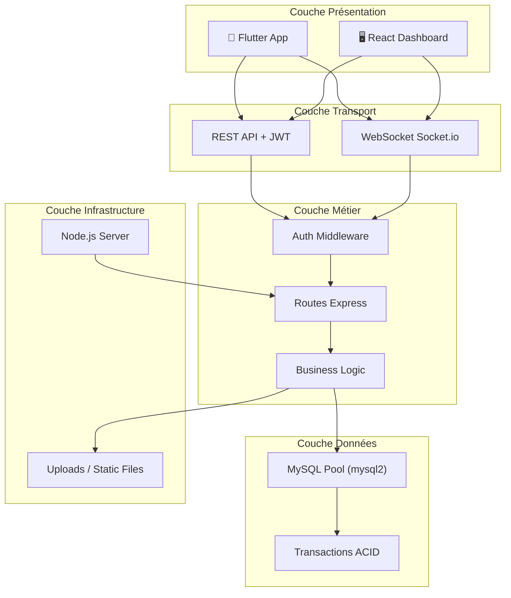
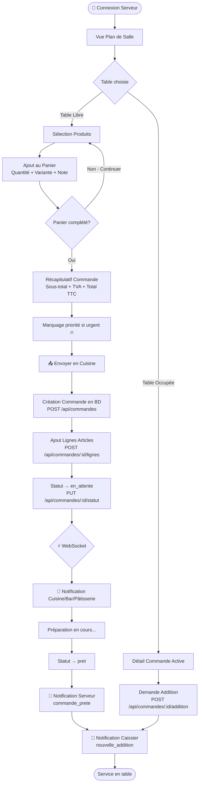
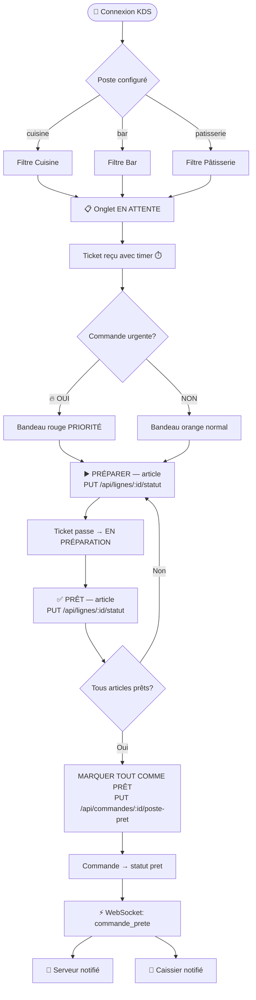
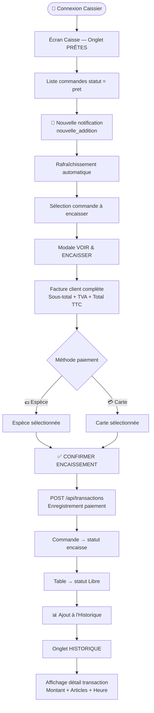
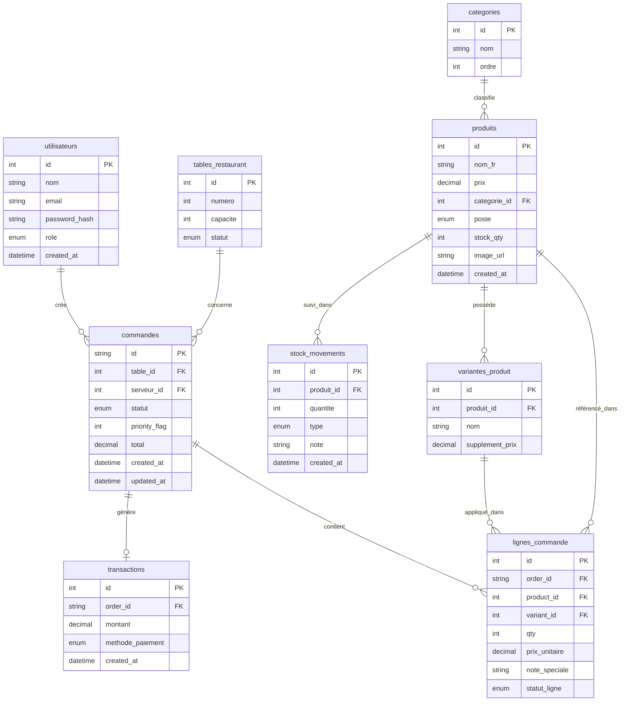

# 🏛️ Architecture du Système Reservo

Ce document détaille l'architecture globale, les workflows principaux et la structure de la base de données du projet Reservo.

---

## 1. Architecture Globale

### 1.1 Vue d'Ensemble

```text
┌─────────────────────────────────────────────────────────────────────────────────┐
│                           RESERVO — ARCHITECTURE SYSTÈME                        │
├──────────────────┬──────────────────┬──────────────────────────────────────────┤
│  📱 APP MOBILE   │  🖥️ DASHBOARD    │          ⚙️  BACKEND (Node.js)           │
│  (Flutter/Dart)  │  (React.js)      │         http://192.168.x.x:5000          │
│                  │  localhost:5173  │                                            │
│  • Serveurs      │  • Admin         │   ┌──────────────┐  ┌──────────────────┐  │
│  • Caissiers     │  • Gérants       │   │  REST API    │  │  WebSocket       │  │
│  • KDS Cuisine   │  • Rapports      │   │  Express.js  │  │  Socket.io       │  │
│  • KDS Bar       │  • Produits      │   └──────────────┘  └──────────────────┘  │
│  • KDS Pâtisserie│  • Utilisateurs  │           ↓                  ↓            │
└──────────────────┴──────────────────┤   ┌──────────────────────────────────────┤
         ↕  HTTP/REST + JWT           │   │     🗄️  BASE DE DONNÉES MySQL        │
         ↕  WebSocket (Socket.io)     │   │     reservo_db                       │
         ↕  JSON Payloads             │   │                                      │
                                      │   │  • commandes      • produits         │
                                      │   │  • lignes_commande • categories      │
                                      │   │  • utilisateurs   • tables           │
                                      │   │  • transactions   • stock_movements  │
                                      │   └──────────────────────────────────────┘
└─────────────────────────────────────────────────────────────────────────────────┘
```

### 1.2 Architecture par Couches



---

## 2. Workflows Complets

### 2.1 Parcours Serveur



### 2.2 Workflow KDS (Cuisine / Bar / Pâtisserie)



### 2.3 Workflow Caissier



---

## 3. Base de Données

### 3.1 Schéma Relationnel (MySQL)



### 3.2 Description des Tables Principales

- **`utilisateurs`** : Contient tous les comptes du personnel (rôles: admin, gerant, serveur, caissier).
- **`commandes`** : Table centrale avec un identifiant UUID v4 généré par le client. Lie la table, le serveur, le statut de la commande et le flag de priorité.
- **`lignes_commande`** : Chaque article d'une commande avec son propre statut de préparation.
- **`produits`** : Catalogue incluant la catégorie, le stock et surtout le `poste` (cuisine, bar, patisserie) qui est la **clé de dispatch KDS**.
- **`transactions`** : Enregistrement immuable de chaque paiement avec sa méthode.
