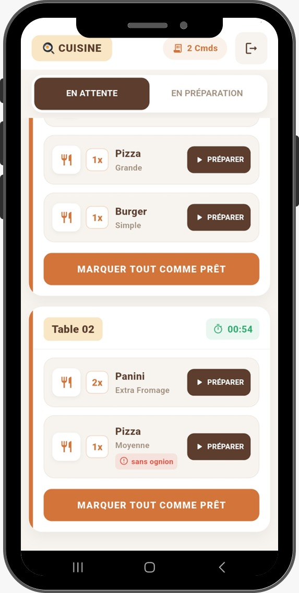
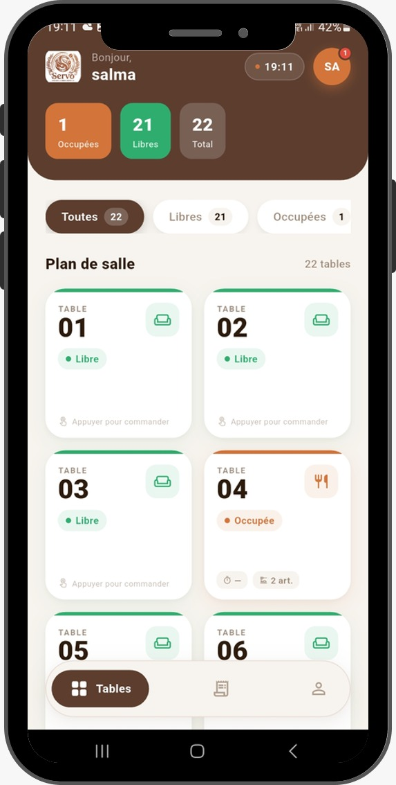
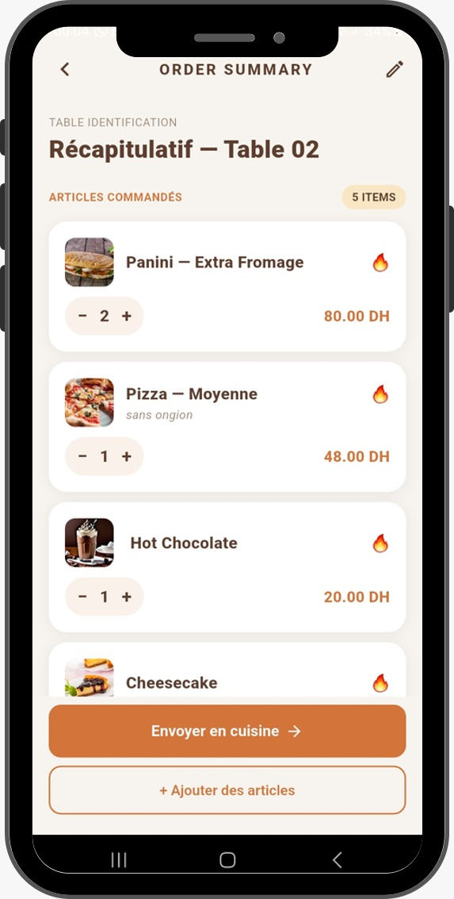
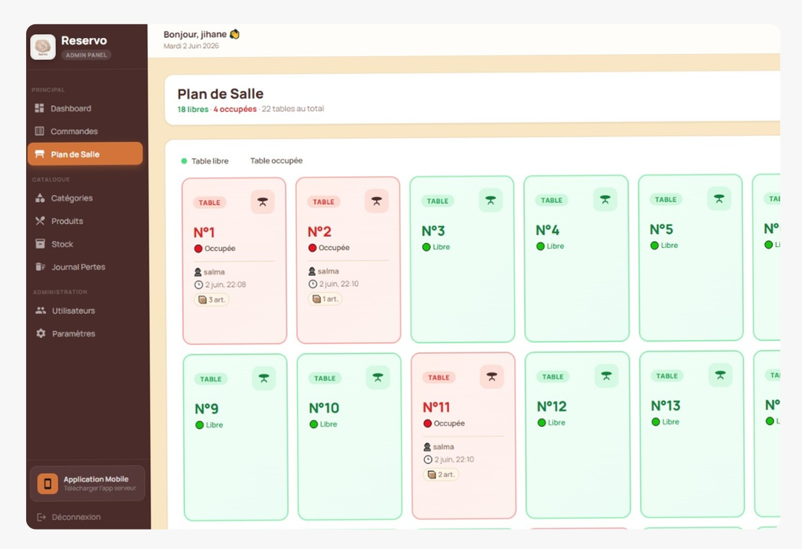

# 🍽️ RESERVO Showcase

> **Système Intelligent de Gestion de Restaurant — Application Mobile & Dashboard Administrateur**

<div align="center">


**CMC Rabat · DEVOAM202 — Projet de Fin d'Études**

*Ce dépôt est une vitrine (Showcase) présentant l'architecture, les fonctionnalités et les technologies du projet Reservo. Le code source propriétaire n'est pas inclus.*

</div>

---

## 📋 Navigation dans la Documentation

Pour découvrir le projet en détail, veuillez consulter les documents thématiques suivants :

1. [**ARCHITECTURE.md**](./ARCHITECTURE.md) : Architecture globale (Mobile + Dashboard + Backend), Modèle de la Base de données et Workflows complets (Serveurs, KDS, Caisse).
2. [**FEATURES.md**](./FEATURES.md) : Détail des fonctionnalités de l'Application Mobile (Serveurs, KDS) et du Dashboard Administrateur.
3. [**TECH_STACK.md**](./TECH_STACK.md) : Stack technique complète, API REST, WebSocket, Sécurité et Optimisation des performances.
4. [**UI_UX.md**](./UI_UX.md) : Design System, palette de couleurs ("premium warm restaurant"), typographie et composants standards.

---

## 🖼️ Aperçus du Projet

> *Ajoutez ici vos captures d'écran en remplaçant les chemins d'images vers le dossier `docs/images/`*

### Application Mobile (Serveurs & KDS)
<div align="center">
  
  &nbsp;&nbsp;&nbsp;
  
  &nbsp;&nbsp;&nbsp;
  
</div>

### Dashboard Administrateur (React)
<div align="center">
  
</div>

---

## 1. Présentation Générale

### 1.1 Description du Projet

**Reservo** est un écosystème numérique complet conçu pour la gestion intelligente et moderne des opérations internes d'un restaurant ou d'un établissement de restauration. Il se compose de trois composants interdépendants :

- 📱 Une **application mobile Flutter** destinée au personnel de salle (serveurs) et aux KDS (Kitchen Display Systems)
- 🖥️ Un **dashboard administrateur React.js** pour la direction et les gérants
- ⚙️ Un **backend Node.js/Express** alimentant l'ensemble via une API REST sécurisée et du WebSocket

Le système centralise et automatise la prise de commande, la transmission en cuisine/bar/pâtisserie, la gestion des tables, l'encaissement et la production de rapports financiers — en **temps réel**, via WebSocket.

---

### 1.2 Vision du Produit

> *"Transformer chaque restaurant en une opération fluide, rapide et sans friction — du bon de commande à la facture — grâce à une technologie intuitive, connectée et évolutive."*

Reservo vise à **éliminer les sources d'erreur humaine** dans le processus de commande, réduire les délais de service, améliorer la coordination entre les équipes de salle et de cuisine, et offrir aux gestionnaires une visibilité complète et instantanée sur les performances de leur établissement.

---

### 1.3 Objectifs Principaux

| # | Objectif | Indicateur de Succès |
|---|----------|----------------------|
| 1 | Digitaliser entièrement la prise de commande | 0 bon papier utilisé |
| 2 | Réduire le délai de transmission cuisine | < 2 secondes via WebSocket |
| 3 | Supprimer les erreurs de commande | Traçabilité complète par ligne d'article |
| 4 | Centraliser la gestion des stocks | Décrémentation automatique à chaque commande |
| 5 | Fournir des rapports en temps réel | Tableau de bord avec KPIs live |
| 6 | Améliorer l'expérience client | Service plus rapide et plus précis |

---

### 1.4 Problématique Résolue

Les restaurants utilisent encore majoritairement des bons de commande papier, des appels vocaux vers la cuisine et des calculs manuels de caisse. Ces pratiques engendrent :

- ❌ Erreurs fréquentes de commande (articles oubliés, mauvais plat servi)
- ❌ Délais de communication importants entre salle et cuisine
- ❌ Impossibilité de suivre les ventes en temps réel
- ❌ Pertes financières liées aux erreurs et aux oublis
- ❌ Manque de coordination entre les postes de préparation (cuisine, bar, pâtisserie)
- ❌ Aucune visibilité sur l'état des tables et de l'occupation

**Reservo résout l'intégralité de ces problèmes** avec une interface mobile intuitive et un système de dispatch intelligent basé sur le poste de chaque produit.

---

### 1.5 Valeur Ajoutée

```text
📊 Réduction des erreurs de commande        → -95%
⚡ Temps de transmission commande→cuisine   → < 2 secondes
💰 Amélioration du chiffre d'affaires       → +15% (moins de pertes)
📈 Productivité du personnel de salle       → +30%
🔍 Visibilité sur les ventes               → Temps réel 24/7
📦 Gestion des stocks                       → Automatique et précise
```

---

### 1.6 Public Cible

| Profil | Rôle dans Reservo | Interface |
|--------|-------------------|-----------|
| 👨‍💼 **Gérant / Directeur** | Consultation des rapports, KPIs, gestion globale | Dashboard Admin (React) |
| 👨‍🍳 **Chef de Cuisine** | Réception et traitement des commandes en cuisine | Écran KDS Cuisine (Flutter) |
| 🍹 **Barman** | Réception et traitement des commandes boissons | Écran KDS Bar (Flutter) |
| 🍰 **Pâtissier** | Réception et traitement des desserts/pâtisseries | Écran KDS Pâtisserie (Flutter) |
| 🧑‍💼 **Serveur** | Prise de commande, gestion des tables | App Mobile (Flutter) |
| 💳 **Caissier** | Encaissement, gestion des paiements | Écran Caisse (Flutter) |
| 👩‍💻 **Administrateur Système** | Configuration, gestion des utilisateurs et produits | Dashboard Admin (React) |

---

> [!NOTE]
> *Pour approfondir les détails techniques et l'architecture du projet, veuillez naviguer vers les autres fichiers Markdown de ce Showcase.*
